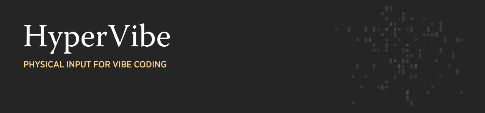
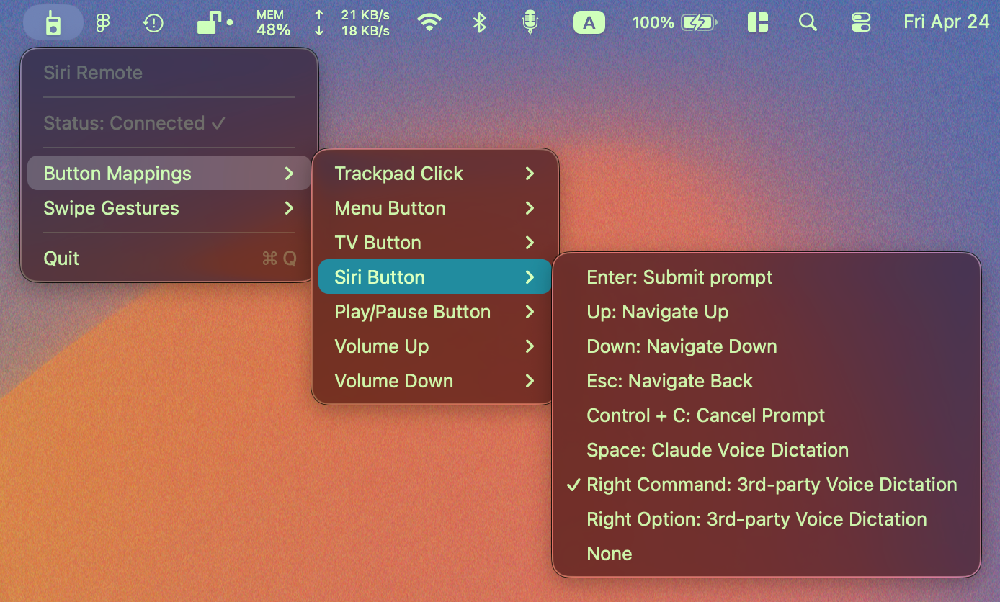
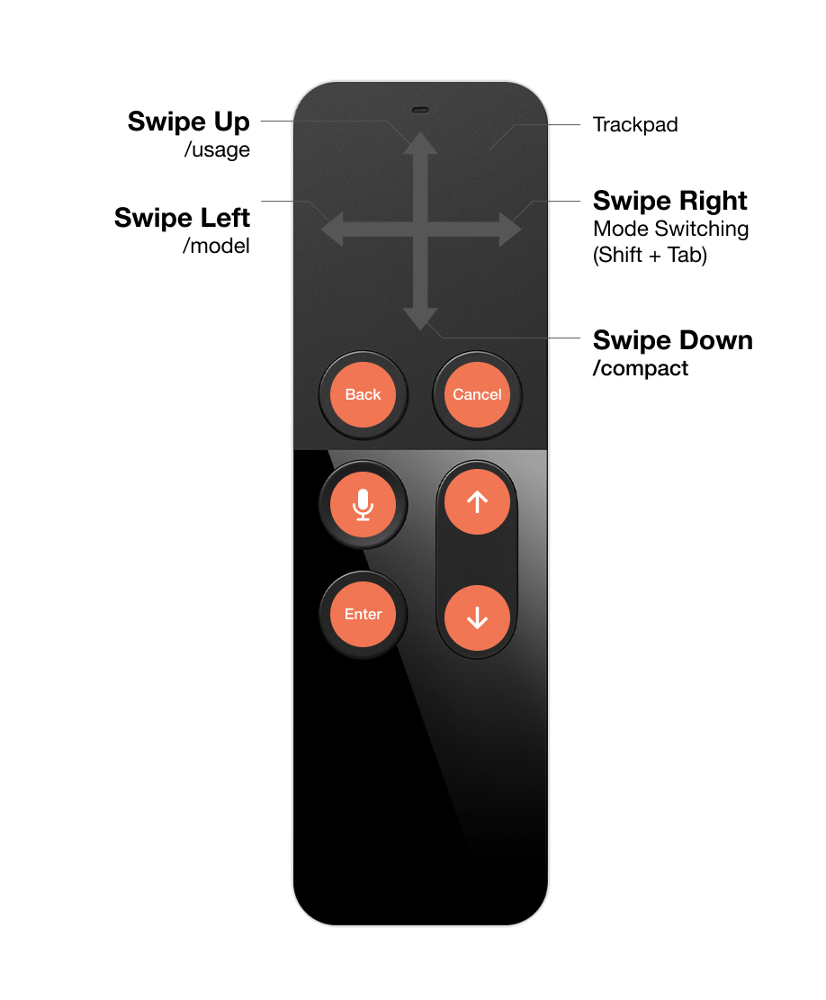

# HyperVibe

A macOS menu-bar app that turns a paired Apple TV Siri Remote into **a walkie-talkie for Claude Code**.

Grab a remote, push to talk, and vibe-code with Claude Code without breaking flow. 

Hyper optimize your vibe coding with a single hand!

Tested with the 1st-gen Siri Remote (Model A1513).

---

## Features

### Buttons

Each physical Siri Remote button is independently assignable via the menu bar.




**Default Button Mapping (Customizable):**
- Menu → Esc
- TV → Ctrl + C
- Siri → Space (Claude Voice Dictation)
- Play/Pause → Enter
- Volume Up → Up
- Volume Down → Down

| Action | Behavior |
|---|---|
| Play/pause button | Enter (submit prompt) |
| Volume up button | Up arrow |
| Volume down button | Down arrow |
| Menu button | Esc (Navigate back) |
| TV button | Control + C (cancel prompt) |
| Trackpad click | Left mouse click |
| Siri/mic button | Space on hold (Claude Voice Dictation |
| Siri/mic button | Right ⌘ on hold (Claude Voice Dictation |
| Siri/mic button | Right ⌥ on hold (Claude Voice Dictation |

**Hold-Capable Buttons:** Push-to-talk actions require buttons that emit both press and release HID events. Only Play/Pause, Volume Up, Volume Down, and Siri buttons allow for both events.


### Swipe Gestures

Four independently configurable single-finger swipe directions on the trackpad surface. Detection is velocity-gated: **distance ≥ 35%** of trackpad, **duration < 350 ms**, **dominant axis ≥ 2×** the other. Slow drags continue to move the cursor; only deliberate flicks trigger actions.




**Default Gesture Mapping (Customizable):**
- Swipe Up → `/usage`
- Swipe Down → `/compact`
- Swipe Left → `/model`
- Swipe Right → Mode Switching (Shift + Tab)

Assignable actions:

- **Arrow keys (direction-matched)**: "Left: Navigate Left" offered only on Swipe Left; "Right: Navigate Right" offered only on Swipe Right.
- **Mode Switching (Shift + Tab)** — toggle between normal / plan / auto-accept modes in Claude Code.
- **`ultrathink`** — inserts the keyword (with trailing space) into the prompt.
- **Slash commands**: `/btw`, `/compact`, `/config`, `/context`, `/effort`, `/init`, `/model`, `/remote-control`, `/schedule`, `/tasks`, `/usage`.
- **None**.

**Trailing-space policy.** Commands that typically take an argument (`/btw`, `/schedule`, `ultrathink`) are typed with a trailing space so you can keep typing. Commands that stand alone or open an interactive picker (`/compact`, `/config`, `/context`, `/effort`, `/init`, `/model`, `/remote-control`, `/tasks`, `/usage`) are typed without a trailing space.

**Enter is never sent** — gestures type the command but leave Enter for the user, so the command can be reviewed, edited, or augmented with arguments.

### Other Trackpad Inputs

- **Cursor movement** via single-finger drag
- **Two-finger scroll** (natural-scroll direction, configurable scale)
- **Tap-to-click** on the trackpad surface
- **Drag** by holding the trackpad click and moving

### Persistence

Button mappings and swipe mappings are saved to UserDefaults (`buttonMappings`, `swipeMappings`) and survive restarts. Schema versioning handles future upgrades (`buttonMappingsSchema`).

### Safety

- **Stuck-key prevention.** If the remote disconnects while a push-to-talk key is held, HyperVibe releases the virtual key automatically.
- **Stale-hold self-heal.** If a release HID event is ever missed, the next press closes the stale hold before opening a new one.
- **HID seize.** On connect, HyperVibe seizes the remote at the HID level so macOS no longer also sees media key events from it — no double-dispatch (e.g., to iTunes/Music), no system funk sound on unhandled keys.

---

## Building

### Prerequisites

- macOS 11 (Big Sur) or later
- Xcode Command Line Tools: `xcode-select --install`

### Build

```bash
./build.sh
```

This runs a single `swiftc` invocation over all the project's Swift files, linking IOKit, CoreGraphics, AudioToolbox, Carbon, AppKit, and the private MultitouchSupport framework via a bridging header. No Xcode project is required.

---

## Installing and Running

1. Build and bundle: `./build.sh && ./create_app_bundle.sh`
2. Move `HyperVibe.app` to `/Applications` (optional but helps icon caching)
3. Launch it (`open HyperVibe.app`)
4. Grant permissions in **System Settings → Privacy & Security**:
   - **Accessibility** (for posting keyboard/mouse events)
   - **Input Monitoring** (for reading HID events)
   - **Bluetooth** (to communicate with the remote)
5. Pair the Siri Remote via **System Settings → Bluetooth** if it isn't already paired
6. Use the menu-bar walkie-talkie glyph to access Button Mappings and Swipe Gestures

A diagnostic log is written to `/tmp/hypervibe.log` (NSLog is redacted under hardened runtime, so HyperVibe uses file-based logging).

---

## Architecture

| File | Role |
|---|---|
| `main.swift` | NSApplication entry point |
| `SiriRemoteApp.swift` | AppDelegate — wires detector, input handler, touch handler, menu bar, and media-key interceptor |
| `RemoteDetector.swift` | IOHIDManager-based device discovery (matches on Apple vendor ID across Consumer / Digitizer / Apple Vendor / Generic Desktop usage pages) |
| `RemoteInputHandler.swift` | HID input callback, button identification, hold tracking, action dispatch |
| `TouchHandler.swift` | MultitouchSupport integration — cursor, scroll, tap, swipe detection |
| `CursorController.swift` | Mouse movement, clicks, drag |
| `MediaKeyInterceptor.swift` | `cghidEventTap` fallback for AVRCP media keys (with 200 ms debounce against the HID path) |
| `MenuBarManager.swift` | Menu bar UI, mappings, persistence, swipe execution |
| `SiriRemote-Bridging-Header.h` | Bridges the private MultitouchSupport C API to Swift |
| `gen_icon.swift` | Renders the app-icon PNG frames for `iconutil` |
| `build.sh` / `create_app_bundle.sh` | Build and bundle scripts |
| `HyperVibe.entitlements` | Hardened-runtime entitlements for Bluetooth HID |

### Why two paths for the same button?

A physical Siri Remote press can arrive two ways:

1. **HID (seized)** — `RemoteInputHandler` reads raw HID input.
2. **AVRCP → NX_SYSDEFINED** — Bluetooth media-key events `MediaKeyInterceptor` catches via an event tap.

Both paths converge on the same button mapping through a 200 ms debounce (static `lastProcessedButton`/`lastProcessedTime` on `RemoteInputHandler`), so a press fires the mapped action exactly once regardless of which path delivers it first.

---

## Caveats

- Uses Apple's **private `MultitouchSupport` framework** — not App Store compatible; Apple may change or remove this API in future macOS releases.
- Tested on **Siri Remote 1st-gen (A1513, product ID `0x266`)**. Button HID codes are a superset likely to cover the 2nd-gen Siri Remote (A2540) as well, but its click-ring directional presses and dedicated Mute button are not yet mapped in `identifyButton`.
- Ad-hoc signing ties TCC permission grants to the exact binary hash — rebuilds may require re-approval in System Settings.

---

## Credits and License

 **Fork & improvements.** HyperVibe is built on top of [Remotastic](https://github.com/lauschue/Remotastic) by [@lauschue](https://github.com/lauschue), which provided the foundational Siri-Remote HID handling, MultitouchSupport integration, and menu-bar scaffolding. HyperVibe extends it with configurable Claude Code workflows, keyboard shortcuts, push-to-talk and swipe gesture.
- License: see `LICENSE`.
- Diagram icons from [The Noun Project](https://thenounproject.com/):
  - [Arrow Up by Dayeong Kim](https://thenounproject.com/icon/arrow-up-6066125/)
  - [Microphone by Alvida](https://thenounproject.com/icon/microphone-8162320/)